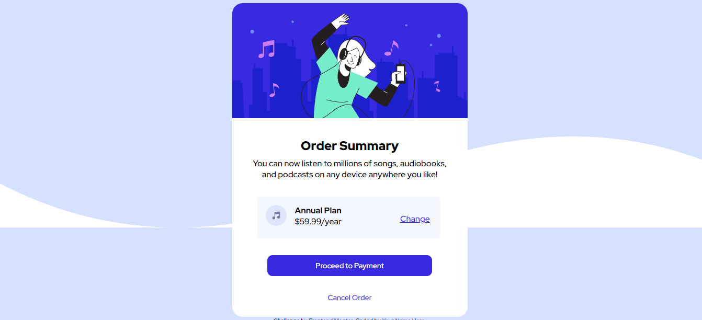

# Frontend Mentor - Order summary card solution

This is a solution to the [Order summary card challenge on Frontend Mentor](https://www.frontendmentor.io/challenges/order-summary-component-QlPmajDUj). Frontend Mentor challenges help you improve your coding skills by building realistic projects. 

## Table of contents

- [Overview](#overview)
  - [The challenge](#the-challenge)
  - [Screenshot](#screenshot)
  - [Links](#links)
- [My process](#my-process)
  - [Built with](#built-with)
  - [What I learned](#what-i-learned)
  - [Continued development](#continued-development)
- [Author](#author)


## Overview

### The challenge

Users should be able to:

- See hover states for interactive elements

### Screenshot




### Links

- Solution URL: (https://github.com/Jekari99/FrontEnd-Mentor-Order-Summary-Component)
- Live Site URL: (https://frontendmentor-ordersummarycomponent-solution.netlify.app/)

## My process

### Built with

- Semantic HTML5 markup
- CSS custom properties
- Flexbox
- Mobile-first workflow

### What I learned

I learned that sometimes it takes layering of "boxes" to achieve the desired layout that you are looking for. Some elements are nested in a div, that is within another div. This allows me to properly place items and align them to how it's supposed to look. 

```html
<div class="order">
          
          <div class="pricing">
            <h4>Annual Plan</h4>
            <p>$59.99/year</p>
          </div>
          <a href="">Change</a>
        </div>
```

Also, with the styling, media queries help with the responsiveness. Using flex is needed, but media queries ensure responsiveness.

```css
@media (max-width: 500px) {
      .box {
        width: 350px;
      }

      .box img {
        width: 350px;
      }
```

### Continued development

In the future, I want to improve css styling. There are many aspects to css styling and it can get confusing to figure out what style you need to achieve your desired result.

## Author

- Website - [Jekari Rawls](https://jekarirawlsportfolio.netlify.app/)
- Frontend Mentor - [@yJekari99](https://www.frontendmentor.io/profile/Jekari99)